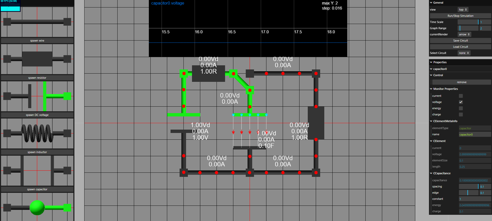
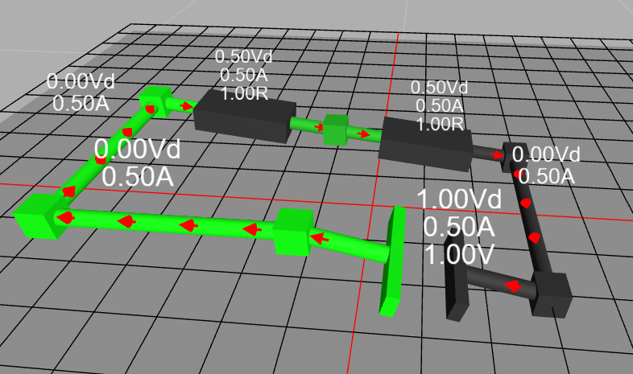
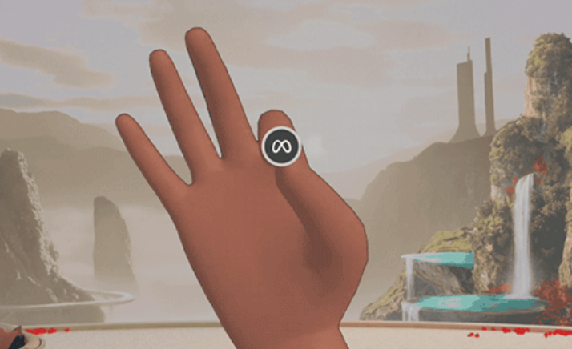

##　回路シミュレーション教育ツール  

## 概要

本システムは、中・高校物理の電磁気分野を対象とした教育ツールです。

## 実験

まず、自由に使用してください。
操作方法は以下の説明を参考にしてください。

### ユースケース

自由に実験することのほか、実際の九州大学入試問題を例として使用していただけます。  

入試問題と解答は、以下のリンクからもアクセスできます 
- [https://buturi0117.com/kyusyu-university-buturi-2024-kaitoukaisetu/](https://buturi0117.com/kyusyu-university-buturi-2024-kaitoukaisetu/)
- [https://buturi0117.com/kyusyu-university-2023-buturi-kaitoukaisetu-1/](https://buturi0117.com/kyusyu-university-2023-buturi-kaitoukaisetu-1/)
- [https://buturi0117.com/kyusyu-univercity-buturi2021-1-2/](https://buturi0117.com/kyusyu-univercity-buturi2021-1-2/)

これらの問題で出現した回路はすでに用意され、GUIの「Select Circuit」でロードできます。　　
シミュレーションをいかに利用するかを考えながら、問題に取り組んでみてください。  

また、用意された回路を利用せず、自分で問題の回路を再現することも試してください。

---

## 画面説明

### 主要コンポーネント

- **Browser(左)**  
  - ドラッグアンドドロップにより部品を配置できる。  
  - または、Buttonをクリックすると、中心に部品が生成されます。　

- **画面中心**  
  - 部品と両側のターミナルをドラッグして移動できます。
  - 導線のGUIでswitch on/offができます。また、ターミナルを移動することもswitchの効果に相当します。　　
  - 被ったターミナルについて、部品からターミナルまで移動することで正確に選択できます。

- **Graph(上)**  　
    - X軸: 時間
    - Y軸: 観測するデータ

- **General(右上)**  　
    - 「View」:視点の調整 
    - シミュレーション関連のコントロール
    - 「Graph Range」:グラフのY範囲の調整 
    - 「Save/Load Circuit」:ローカル環境への保存・再生　
    - 「Select Circuit」:既に用意された回路のロード

- **Properties(右)**  　
    - 部品をクリックして出現し、Context情報に相当する。
    -「remove」:削除する
    -「Monitored Properties」:物理量の選択することでグラフに加わる
    -「C+部品名」:パラメーターの調整
    -など

### 基礎操作

まず、以下の操作を試してください 
   - Browserパネルから部品を生成し、画面上に配置する
   - Propertiesパネルで部品の名前や物理量を調整する 
   - 観測したい物理量を選び、Graphに反映させる 
   - Generalパネルをでシミュレーションを操作する

---

## モード

### Top View　
  - 右クリックをドラッグして視点が平行移動します。

### 3D View
  - 左クリックで視点が回転移動します。  
  - 右クリックで視点が平行移動します。
- **注目ポイント**:  
- 2Dと主の違いとしては、Generalパネルで電位を高さに反映できることです。ただし、移動することは難しくなるため、回路の構築にはOFFにしたこと。

### VRモード
  - GUIでVRに切り替え、VR対応環境でVR ButtonをクリックしてVRモードに入ります。　
  - OculusのOSと同じ感覚で、Rayを使用して部品やGUIを操作します。  
  - ジェスチャーのPinchはクリックに相当します。ほかに通常のブラウザー操作と大きく変わりません。 

  - 以下のジェスチャーでimmersive VRから出ます
　

 ## ほかの仕様

- saveせずにページをリロードすると、現在の内容が破棄される
- loadしても現在の内容が破棄されない